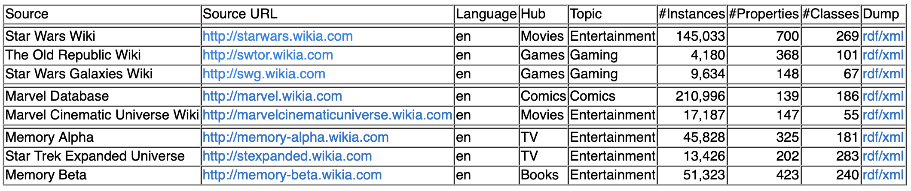
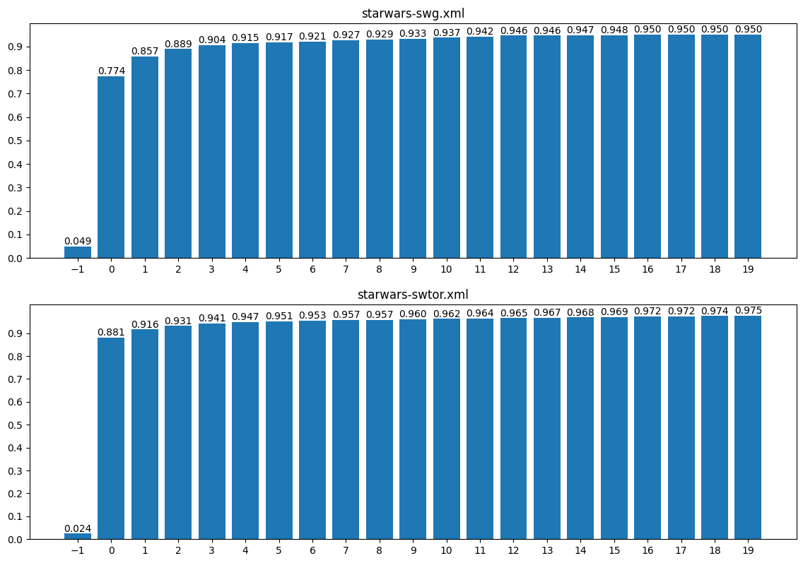
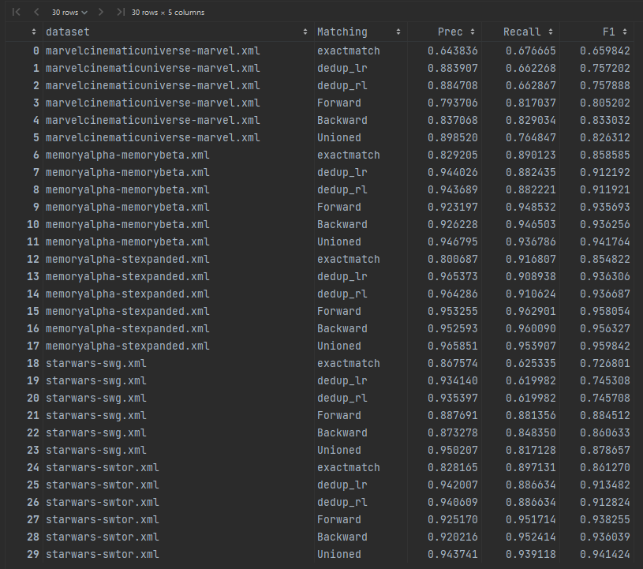

\begin{center}
\huge From Top-1 to Top-10: A Two-Stage Entity Alignment Framework for Knowledge Graphs
\end{center}

\vspace{1.5cm}

## Table of Contents

1. [Introduction](#introduction)
2. [Objectives](#objectives)
3. [Background and Related Work](#background-and-related-work)
4. [Methodology](#methodology)
   - [Dataset](#dataset)
   - [Proposed Solution](#proposed-solution)
   - [AI Model Integration](#ai-model-integration)
   - [Prompt Engineering](#prompt-engineering)
5. [Implementation Details](#implementation-details)
   - [Technologies Used](#technologies-used)
   - [Code Organization](#code-organization)
6. [Results](#results)
7. [Discussion](#discussion)
   - [Impact on Research Area](#impact-on-research-area)
   - [Limitations and Future Work](#limitations-and-future-work)
8. [Conclusion](#conclusion)
9. [Appendices](#appendices)

\vspace{1.5cm}

## Introduction

Entity alignment is a critical task in knowledge graph research, focusing on identifying and linking equivalent entities across different knowledge graphs. Accurate entity alignment facilitates data integration, semantic interoperability, and the construction of unified knowledge bases, which are foundational for numerous applications in real-life scenarios.

In this project, we explore entity alignment using graph embeddings and large language models (LLMs). Initially, we generate vector representations for each node in the knowledge graph using graph embedding techniques. These embeddings enable us to measure the similarity between nodes based on their cosine similarity scores. Our current approach pairs nodes by identifying the top-1 match for each vertex based on this metric. While effective, this method may overlook nuanced relationships that could improve alignment accuracy.

\newpage

To address this limitation, we propose an enhanced two-stage approach:

1. **Candidate Generation**: For each node, we will identify the top-10 most similar nodes based on cosine similarity scores derived from their graph embeddings.

2. **Refined Pairing**: Using large language models, we will further analyze the string attributes of the candidate nodes to determine the optimal alignment. This step leverages the semantic understanding capabilities of LLMs to refine alignment decisions beyond what numerical similarity scores can achieve.

This hybrid method aims to improve alignment precision by combining the structural insights from graph embeddings with the contextual analysis power of LLMs. By integrating these techniques, the project seeks to advance the state-of-the-art in knowledge graph entity alignment and provide a robust framework for tackling real-world challenges in this domain.

\vspace{1.5cm}

## Objectives

The primary objectives of this project are as follows:

1. **Demonstrate the Complementary Benefits of Structural and Entity-Level Information**
   - Show how combining structural embeddings (graph-based information) with entity-specific attributes enhances the accuracy and effectiveness of entity matching in knowledge graphs.
   - Provide empirical evidence supporting the hypothesis that both structural and entity-level information are critical for robust entity alignment.

2. **Showcase the Strength of Combining Basic Embeddings and Large Language Models (LLMs)**
   - Highlight the effectiveness of a two-stage approach where basic graph embeddings generate candidate matches, and LLMs refine these matches using semantic and contextual information from string attributes.
   - Illustrate how integrating these methods bridges the gap between structural similarity and semantic understanding.

Through these objectives, the project aims to advance state-of-the-art techniques for knowledge graph entity alignment and establish a practical framework for leveraging hybrid approaches in real-world applications.

\vspace{1.5cm}

## Background and Related Work

### Knowledge Graphs and the Entity Alignment Problem

Knowledge graphs (KGs) are powerful data structures used to represent entities and their relationships in a graph format. They are extensively employed in applications such as search engines, recommendation systems, and question answering. However, integrating multiple knowledge graphs is often challenging due to differences in schema, incomplete data, and inconsistencies across graphs.

Entity alignment, a critical step in integrating knowledge graphs, involves identifying equivalent entities across different graphs. This task is complicated by the need to resolve structural, semantic, and syntactic variations.

### Graph Embeddings for Entity Matching

Graph embeddings are a popular technique for representing the structural properties of knowledge graphs in a continuous vector space. Methods like DeepWalk, Node2Vec, and Graph Neural Networks (GNNs) encode nodes while preserving their relational and contextual properties. These embeddings are particularly effective for tasks like link prediction, node classification, and entity alignment. However, structural embeddings often overlook the semantic nuances of entities, limiting their alignment performance in complex scenarios.

### The Role of Large Language Models (LLMs) in Semantic Analysis

Large Language Models (LLMs) such as GPT and BERT have demonstrated remarkable capabilities in understanding and generating natural language. By leveraging pre-trained contextual embeddings, LLMs can analyze and compare string attributes of entities with a deep semantic understanding. Recent research highlights their potential in augmenting graph-based methods, particularly for tasks requiring fine-grained semantic matching.

### Hybrid Approaches for Enhanced Entity Alignment

State-of-the-art approaches for entity alignment often integrate structural and semantic methods to overcome the limitations of individual techniques. For instance, hybrid methods leverage graph embeddings for candidate generation while using LLMs or other semantic models for refining alignment decisions. Despite their promise, these methods face challenges in effectively combining structural and entity-level information, which this project aims to address.

By building on these foundational methods, this project introduces a two-stage approach that combines basic graph embeddings for candidate generation with LLMs for refined matching. This hybrid framework seeks to demonstrate the complementary benefits of structural and semantic information for robust and scalable entity alignment.

\vspace{1.5cm}

## Methodology

### Dataset

For this project, we chose the Ontology Alignment Evaluation Initiative dataset, which is available here:
[LINK](https://oaei.ontologymatching.org/2024/knowledgegraph/index.html)

\vspace{0.25cm}

*Fig. 1   Dataset used in the project*
\vspace{0.25cm}

This dataset contains scraped Wiki Fandom pages in the form of knowledge graphs. There are 3 different topics (Star Wars, Marvel and Star Trek) and there are 5 given knowledge graph pairs that has to be tested:

- starwars-swg
- starwars-swtor
- marvelcinematicuniverse-marvel
- memoryalpha-memorybeta
- memoryalpha-stexpanded

For example, if we take a look at 'starwars-swg', the task is to pair nodes in the 'starwars' and 'swg' knowledge graphs. The gold node pairs for each graph pair are also given on the website. This way different solutions can easily be evaluated and compared to each other.

### Proposed Solution

As the initial step, we clean the input knowledge graphs. The dataset is very unorganized, there are a lot of unnecessary nodes and edges (images, file paths, etc). This way, around half of the nodes and edges were discarded in each network.

After the cleaning step, we create so-called 'dogtags' for each node in the graphs. A dogtag is a string containing the most important information for a given node, namely its label, alternative label, type, abstract and comment.

For example:

```
Label: Gordon Connors
Alternative Label: Gordon Connors
Type: character
Abstract: Senior Lieutenant Gordon Connors (call sign Gordo) was a ...
Comment: His pilot was Colleen Norris.
```

Then we take these dogtags for each node (concatenate all 5 fields into a single string), and calculate embeddings for them. For this task, we use BGE, specifically bge-large-en-v1.5. With this tool, we calculate embedding vectors of 1024 dimensions. The model can be found at Hugging Face here:
[LINK](https://huggingface.co/BAAI/bge-large-en-v1.5/tree/main)

Now that we have embedding vectors for every node, we take a graph pair A-B. We take a certain node from graph A and we calculate its cosine similarity to every node in graph B. Our baseline solution is to take the most similar node from graph B (the top-1 solution).

### AI Model Integration

During experimetning, we noticed that if we take the top-10 most similar nodes to a selected node, a lot more gold pairs appear. Figure 2 shows this experiment for two graph pairs. On the X axis, -1 means that the desired gold pair is not in the top-20, 0 means the gold pair is in the top-1, ..., 19 means the gold pair is in the top-20.

\vspace{0.25cm}

*Fig. 2   How many gold pairs are in the top-1 to top-20 most similar nodes?*
\vspace{0.25cm}

In other words, if we had a method that can effectively select 1 node from the 10 given options, we could achive better results. Our idea was to integrate AI to this step. We wanted to use an LLM, provide possible solutions and let the LLM choose the node which it thinks is the actual pair. For this purpose, we used OpenAI's 'gpt-4o-mini' model.

### Prompt Engineering

We call the OpenAI API with the following prompt:

\vspace{0.25cm}
```
Task: You will be given a description of an anchor entity and a list of
candidate entities, all formatted with XML tags. Your task is to:
- Identify the candidate entity that matches the anchor entity.
- Return the ID number of the matching candidate entity.
- If none of the candidates match the anchor entity, return -1.
###
Anchor: {anchor}
###
{candidate_str}
###
Answer:
```
\vspace{0.25cm}

The 'anchor' is the entity we want to pair, and the candidates are the top-10 most similar nodes from the other graphs. The anchor and the answer together forms a pair.

\vspace{1.5cm}

## Implementation Details

The whole codebase was written in Python, using certain packages for different tasks. They are either normal '.py' Python files (for longer runs) or '.ipynb' Jupyter Notebooks (mainly for experimenting and visualizations).

Source code and additional materials can be found in the following GitHub repository:
[LINK](https://github.com/material1999/PromptEngineeringProject)

### Technologies Used

The following tools, frameworks and libraries were utilized in the project:

- xml: Parsing the input database to a more human-readable format.
- json: Store and read saved data easily.
- torch: For machine learning tasks.
- sentence_transformers: Embedding dogtags with BGE.
- fuzzywuzzy: Calculate string similarity for deduplication.
- tqdm: Measuring runtime of certain code parts.
- pandas: Working with large amounts of data.
- numpy: Working with large amounts of data.
- matplotlib: Creating charts for visualization.
- openai: For OpenAI API calls.
- networkx: Working with graphs.

### Code Organization

A short description of each code file from the GitHub repository:

- alignment_format: Helper file to read the 'rdf' formatted input data.
- cosinesimilarity_top10pairs: For a node in graph A, calculate the cosine similarity compared to every other node in graph B. Keep the top-10 most similar nodes and repeat the process for each node in graph A.
- deduplicate_fuzzy: If multiple exact matches are found, keep the one that has the most similar URL.
- dogtag_embeddings: Create dogtags for each node and calculate their sentence embeddings using BGE.
- edge_browser: Helper file to browse the original input networks.
- eval: Helper file for evaluation purposes.
- evaluator: For calculating our final results (precision, recall and F1-score for each setting).
- exact_matching: Find exact matches in node labels.
- gold_top10_overlap: Checking the percentage of gold pairs found in the top-1 to top-20 range.
- gold_top10pairs_recall: Checking the percentage of gold pairs found in the top-10 to top-1000 range.
- gptcall_top10: Calling the OpenAI API to select one node from the top-10 possible options.
- intellisense: Helper functions for calculating recall.
- loaders: Helper file to load data.

\vspace{1.5cm}

## Results

In our evaluation, we had the following settings:

- exact matches: if the label or alternative label of two nodes are the same, they can be considered a pair
- deduplications: there can be multiple exact macthes, then we deduplicate using URL sring distance (take the node with the most similar URL)
- top-1: take the most similar node based on cosine similarity between embeddings
- top-10 + LLM: take the most similar node based on cosine similarity between embeddings and ask an LLM to select the pair from the provided options

For each of the settings, we tried the pairing in both directions (from A to B and from B to A). To measure performance, we calculated precision, recall and F1-score for the settings.

\vspace{0.25cm}

*Fig. 3   Evaluation results of all the settings*
\vspace{0.25cm}

Figure 3 shows our testing results. If we also look back at Figure 2, we can see that even with the deduplicated exact macthes (dedup_lr and dedup_rl) we can achieve better results than the top-1 most similar nodes based on cosine similarity. However, the F1-scores are still pretty low for these settings. The top-10 + LLM settings (Forward: from A to B, Backward: from B to A, Unioned: if Forward and Backward give the same result) produce way better F1-scores while keeping around the same precision and recall.

\vspace{1.5cm}

## Discussion

### Impact on Research Area

Our project contributes to the field in several significant ways. First and foremost, we observed a notable gap in the existing literature concerning entity alignment in knowledge graphs, particularly in approaches that integrate structural embeddings with language models. While many traditional methods focus on either purely structural similarity or purely semantic similarity, our hybrid framework combines the strengths of both, offering a more comprehensive solution to the entity alignment problem.

To the best of our knowledge, our proposed method is among the first to explicitly utilize graph embeddings in conjunction with large language models (LLMs) for entity alignment. This integration allows us to leverage the representational power of graph embeddings for candidate selection while simultaneously refining these selections using the deep semantic understanding of LLMs. By combining these two approaches, we bridge a critical gap in existing methodologies, demonstrating that structural and contextual information together can significantly improve entity alignment accuracy.

Furthermore, a key advantage of our methodology is its efficiency in terms of computational resources. Given that entity alignment can be a highly resource-intensive task, particularly when working with large-scale knowledge graphs, optimizing LLM usage is crucial. Our approach minimizes the number of LLM calls by first reducing the candidate search space using graph embeddings. Instead of querying the LLM for every possible entity pair in the dataset, we narrow the search down to the top-10 most similar candidates, ensuring that only the most relevant options are considered. This significantly reduces the computational cost and makes the approach scalable to large networks containing millions of nodes and edges.

### Limitations and Future Work

We acknowledge that our methodology is not perfect and has some inherent limitations. One of the main challenges was the selection and optimization of prompts for the LLM. While our chosen prompt yielded promising results, further experimentation with alternative prompt formulations could potentially enhance the model’s accuracy and decision-making capabilities. A more systematic evaluation of different prompting techniques, including few-shot learning or chain-of-thought prompting, might provide additional insights into how LLMs can be better utilized for entity alignment.

Another challenge we encountered was the preprocessing and cleaning of the knowledge graph data. The raw dataset was highly unstructured, containing numerous irrelevant or noisy nodes and edges, such as file paths, images, and metadata entries. While our filtering process removed a significant amount of unnecessary information, there remains a possibility that some useful details were also discarded. A more refined cleaning pipeline, possibly incorporating additional heuristics or machine learning techniques, could help preserve essential information while still improving data quality for the alignment task.

\newpage

Looking ahead, there are several promising directions for future work. One clear avenue for improvement would be to experiment with larger and more powerful sentence embedding models. While the BGE-large-en-v1.5 model performed well, newer or domain-specific embedding techniques might yield better representations for the knowledge graph entities. Similarly, employing more advanced LLMs, such as GPT-4-turbo or specialized entity matching models, could further improve the refinement process, leading to even higher precision in entity alignment.

However, it is important to acknowledge that our project was constrained by computational and financial resources. Running large-scale LLM queries, especially on extensive knowledge graphs, can be costly and time-intensive. Therefore, an interesting future research direction would be to explore cost-efficient strategies, such as distilling large models into smaller, fine-tuned ones or leveraging open-source alternatives.

Despite these limitations, our approach demonstrated competitive results on the chosen dataset, highlighting the potential of hybrid methodologies that integrate structural embeddings with LLM-based semantic analysis. By refining and extending our work, we hope to contribute further to the field of entity alignment and knowledge graph integration, making these techniques more accessible and practical for real-world applications.

\vspace{1.5cm}

## Conclusion

In this project, we introduced a two-stage entity alignment framework that leverages graph embeddings for candidate generation and large language models (LLMs) for refined pairing. Our results demonstrate that relying solely on cosine similarity for entity matching may overlook optimal alignments, whereas incorporating LLMs enhances precision by effectively selecting the correct match from a set of top candidates. The evaluation showed significant improvements in F1-score when integrating LLMs into the alignment process, confirming that structural and semantic information are complementary for this task. While our approach is not without limitations, such as the need for further prompt optimization and potential data cleaning improvements, it presents a promising direction for scalable and efficient entity alignment. Ultimately, our framework lays the foundation for more robust and adaptable entity alignment techniques in knowledge graph research.

\vspace{1.5cm}

## Appendices

1. GitHub Repository with source code and additional materials:
[LINK](https://github.com/material1999/PromptEngineeringProject)

2. Dataset:
[LINK](https://oaei.ontologymatching.org/2024/knowledgegraph/index.html)

3. BGE string embedding:
[LINK](https://huggingface.co/BAAI/bge-large-en-v1.5/tree/main)
